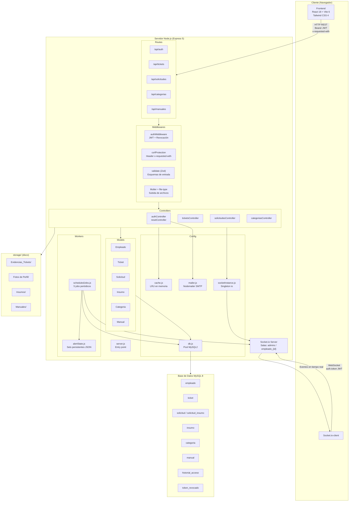

# DOCUMENTATION — PrecisionTrucks HelpDesk

> Memoria Técnica de Arquitectura · v1.0.0

---

## 1. Arquitectura del Sistema

### 1.1 Diagrama de bloques conceptual



### 1.2 Módulos funcionales

| Módulo | Responsabilidad |
|--------|----------------|
| **Core** | Autenticación, gestión de empleados, catálogos, sesiones |
| **HelpDesk** | Ciclo completo de tickets: creación, atención, resolución, calificación, SLA |
| **Inventario** | CRUD de insumos, solicitudes de materiales, control de stock |
| **Documentación** | Subida, edición y consulta de manuales PDF |
| **Notificaciones** | Socket.io + Web Audio API + historial persistente en localStorage |
| **Workers** | 5 jobs periódicos: SLA, cierre automático, sesiones, stock, sin atender |

---

## 2. Guía de Configuración

### 2.1 Requisitos previos

- Node.js 18+
- MySQL 8.x
- npm

### 2.2 Instalación

```bash
# 1. Clonar e instalar dependencias
git clone <url-del-repo>
cd PrecisionTrucks_HelpDesk
npm install

# 2. Configurar variables de entorno
cp .env.example .env
# Editar .env con los valores reales (ver sección 2.3)

# 3. Importar esquema de base de datos
mysql -u root -p < database.sql
```

### 2.3 Variables de entorno críticas

| Variable | Descripción | Requerida |
|----------|-------------|-----------|
| `JWT_SECRET` | Clave HMAC para firmar tokens (mín. 64 bytes hex) | ✅ |
| `DB_HOST` | Host MySQL | ✅ |
| `DB_USER` | Usuario MySQL | ✅ |
| `DB_PASSWORD` | Contraseña MySQL | ✅ |
| `DB_NAME` | Nombre de la base de datos | ✅ |
| `PORT` | Puerto del servidor Express (default: 3001) | ❌ |
| `CORS_ORIGIN` | Origen permitido (default: http://localhost:5173) | ❌ |
| `SMTP_HOST/PORT/USER/PASS/FROM` | Configuración SMTP para correos | ❌ |
| `VITE_API_URL` | URL base del API para el frontend en producción | ❌ |

> Generar `JWT_SECRET`: `node -e "require('crypto').randomBytes(64).toString('hex')|console.log"`

### 2.4 Comandos de desarrollo

```bash
# Frontend (Vite :5173) + Backend (Express :3001) en paralelo
npm run dev:all

# Solo frontend
npm run dev

# Solo backend
npm run server

# Build de producción
npm run build
```

### 2.5 Verificación

```
GET http://localhost:3001/api/ping
→ { "status": "ok", "message": "Servidor HelpDesk activo ✅" }
```

---

## 3. Dependencias Clave

### 3.1 Backend

| Librería | Versión | Propósito |
|----------|---------|-----------|
| `express` | ^5.2.1 | Framework HTTP, routing, middlewares |
| `mysql2` | ^3.22.3 | Driver MySQL con soporte de promesas nativas y pool de conexiones |
| `socket.io` | ^4.8.3 | WebSockets bidireccionales para notificaciones en tiempo real |
| `jsonwebtoken` | ^9.0.3 | Firma y verificación de tokens JWT (HS256, 12h) |
| `bcryptjs` | ^3.0.3 | Hash de contraseñas con salt (12 rounds) |
| `zod` | ^4.4.3 | Validación y coerción de esquemas de entrada en todos los endpoints |
| `multer` | ^2.1.1 | Manejo de multipart/form-data para subida de archivos |
| `file-type` | ^22.0.1 | Detección de tipo real por magic bytes (segunda barrera de validación) |
| `sharp` | ^0.35.3 | Compresión y redimensionado de imágenes de evidencia |
| `helmet` | ^8.2.0 | Cabeceras de seguridad HTTP (CSP, HSTS, X-Content-Type, etc.) |
| `express-rate-limit` | ^8.5.2 | Rate limiting por IP en endpoints sensibles |
| `nodemailer` | ^9.0.1 | Envío de correos SMTP (recuperación de contraseña) |
| `compression` | ^1.8.1 | Compresión gzip/deflate de respuestas HTTP |
| `dotenv` | ^17.4.2 | Carga de variables de entorno desde `.env` |

### 3.2 Frontend

| Librería | Versión | Propósito |
|----------|---------|-----------|
| `react` / `react-dom` | ^18.3.1 | UI declarativa con hooks y Concurrent Mode |
| `react-router-dom` | ^7.15.0 | Enrutamiento SPA con rutas protegidas por rol |
| `socket.io-client` | ^4.8.3 | Conexión WebSocket al servidor con autenticación JWT |
| `lucide-react` | ^1.12.0 | Iconografía SVG centralizada |
| `pdfjs-dist` | ^6.0.227 | Renderizado de portadas PDF en el módulo de manuales |
| `dompurify` | ^3.4.11 | Sanitización de HTML para prevenir XSS |

### 3.3 Build / Dev

| Librería | Propósito |
|----------|-----------|
| `vite` ^6.3.5 | Bundler con HMR, proxy de desarrollo y build optimizado |
| `@vitejs/plugin-react` | Soporte JSX y Fast Refresh |
| `tailwindcss` ^4.1.7 | Utilidades CSS con plugin nativo de Vite |
| `concurrently` | Ejecución paralela de frontend y backend en desarrollo |

---

## 4. Estructura de Directorios

```
PrecisionTrucks_HelpDesk/
├── src/
│   ├── Backend/
│   │   ├── Config/          ← Pool DB, mailer, socket singleton, caché LRU
│   │   ├── Controllers/     ← Lógica de negocio HTTP (auth, tickets, solicitudes, categorías)
│   │   ├── Middlewares/     ← JWT, CSRF, validación Zod, Multer + magic bytes
│   │   ├── Models/          ← Queries SQL encapsuladas por entidad
│   │   ├── Routes/          ← Definición de rutas con guards y rate limits
│   │   ├── Workers/         ← Jobs periódicos y persistencia de estado de alertas
│   │   ├── utils/           ← Helpers transaccionales (generarFolio)
│   │   └── server.js        ← Entry point: Express + Socket.io + workers
│   ├── Frontend/
│   │   ├── Components/      ← Componentes reutilizables (UI, hooks, contextos)
│   │   ├── Config/          ← API client, sesión, socket hook, notificaciones, tema
│   │   ├── Pages/
│   │   │   ├── Admin/       ← Vistas exclusivas del rol administrador
│   │   │   └── Usuario/     ← Vistas exclusivas del rol usuario
│   │   └── Styles/          ← CSS global y design system
│   └── main.jsx             ← Entry point React: proveedores + rutas protegidas
├── storage/                 ← Archivos subidos (no versionar contenido)
├── docs/                    ← Documentación técnica adicional
├── public/                  ← Assets estáticos (logos, .htaccess)
├── .env.example             ← Plantilla de variables de entorno
├── vite.config.js           ← Configuración Vite + proxy de desarrollo
└── package.json
```

---

## 5. Flujos de Negocio Principales

### 5.1 Autenticación

```
POST /api/auth/login
  → validate(schemaLogin)
  → Empleado.findByEmail()
  → bcrypt.compare()
  → Empleado.cerrarSesionesHuerfanas()
  → Empleado.registrarEntrada()
  → jwt.sign({ id_empleado, id_rol, jti }, 12h)
  → { token, id_acceso, usuario }
```

### 5.2 Ciclo de vida de un ticket

```
POST /api/tickets          → crearTicket()  → Ticket.crear() [FOR UPDATE folio]
                                            → emit("ticket:nuevo") → admins
PATCH /api/tickets/:id     → actualizarTicket() → Ticket.actualizar()
                                               → emit("ticket:en_atencion" | "ticket:actualizado")
PATCH /api/tickets/:id/calificar → calificarTicket() → Ticket.guardarCalificacion()
                                                     → emit("ticket:calificado") → admins
```

### 5.3 Solicitud de insumos con descuento de stock

```
POST /api/solicitudes      → crearSolicitud() → Solicitud.crear() [transacción + FOR UPDATE stock]
PATCH /api/solicitudes/:id/estatus (Resuelto)
  → BEGIN TRANSACTION
  → SELECT solicitud FOR UPDATE
  → Insumo.descontarStock() [FOR UPDATE por insumo]
  → UPDATE solicitud SET estatus = 'Resuelto'
  → COMMIT
  → emit("insumo:stock_critico") si stock ≤ 5
  → emit("solicitud:actualizada") → empleado + admins
```

### 5.4 Recuperación de contraseña

```
POST /recuperar       → crypto.randomInt(6 dígitos) → bcrypt.hash → tokens Map → enviarCodigoRecuperacion()
POST /verificar-codigo → bcrypt.compare → marcarVerificado
POST /reset-password  → validar política → bcrypt.hash(12) → Empleado.updatePerfil → deleteToken
```

---

## 6. Seguridad

| Mecanismo | Implementación |
|-----------|---------------|
| Autenticación | JWT HS256, 12h, renovable vía `/api/auth/refresh-token` |
| Revocación de tokens | Tabla `token_revocado` consultada en cada request autenticado |
| CSRF | Header `x-requested-with: XMLHttpRequest` en todas las mutaciones |
| Rate limiting | Login: 10/15min · Recuperación: 5/15min · Tickets: 30/h · Solicitudes: 20/h |
| Cabeceras HTTP | Helmet: CSP, HSTS, X-Content-Type, Referrer-Policy |
| Path traversal | `safeResolvePath()` en todas las operaciones de archivo |
| Validación de archivos | Doble barrera: mimetype declarado (Multer) + magic bytes reales (file-type) |
| Compresión de imágenes | sharp: redimensiona a máx 1920×1920, JPEG 75% antes de guardar |
| Bloqueo de archivos sensibles | `/storage` rechaza `.json` y `.env` |
| Fotos de perfil | `/fotos` requiere JWT válido |
| Contraseñas | bcrypt 12 rounds · Política: 8+ chars, mayúscula, número, símbolo especial |

---

## 7. Eventos Socket.io

| Evento | Sala destino | Emisor | Descripción |
|--------|-------------|--------|-------------|
| `ticket:nuevo` | `admins` | ticketsController | Nuevo ticket creado |
| `ticket:confirmado` | `empleado_{id}` | ticketsController | Confirmación inmediata al creador |
| `ticket:en_atencion` | `empleado_{id}` + `admins` | ticketsController | Técnico asignado |
| `ticket:actualizado` | `empleado_{id}` + `admins` | ticketsController / scheduledJobs | Cambio de estatus |
| `ticket:calificado` | `admins` | ticketsController | Usuario calificó ticket |
| `ticket:cancelado` | `empleado_{id}` + `admins` | ticketsController | Ticket cancelado |
| `ticket:sla_warning` | `admins` | scheduledJobs (30min) | Ticket ≥ 46.5h abierto |
| `tickets:vencidos` | `admins` | scheduledJobs (1h) | Cierre automático por SLA |
| `ticket:sin_atender` | `admins` | scheduledJobs (1h) | Ticket ≥ 24h sin técnico |
| `solicitud:nueva` | `admins` | solicitudesController | Nueva solicitud de insumos |
| `solicitud:actualizada` | `empleado_{id}` + `admins` | solicitudesController | Cambio de estatus |
| `insumo:stock_critico` | `admins` | solicitudesController / scheduledJobs | Stock ≤ 5 unidades |

---

## 8. Base de Datos — Tablas Principales

| Tabla | PK | Descripción |
|-------|----|-------------|
| `empleado` | `id_empleado` | Usuarios del sistema; password bcrypt 12 rounds |
| `historial_acceso` | `id_acceso` | Registro de logins/logouts; CASCADE al eliminar empleado |
| `token_revocado` | `id_revocado` | JTIs revocados por logout explícito |
| `ticket` | `id_ticket` | Incidencias técnicas; folio `PTP-YYYYMM-NNN` |
| `ticket_historial` | `id_historial` | Auditoría de cambios de campo en tickets |
| `insumo` | `id_insumo` | Inventario de materiales con control de stock |
| `solicitud` | `id_solicitud` | Solicitudes de insumos; folio `SOL-YYYYMM-NNN` |
| `solicitud_insumo` | `id_solicitud_insumo` | Ítems de cada solicitud (tabla de unión) |
| `manual` | `id_manual` | Registros de PDFs del módulo de documentación |
| `categoria` | `id_categoria` | Catálogo compartido por tickets, insumos y manuales |
| `departamento` | `id_departamento` | Áreas de la empresa |
| `rol` | `id_rol` | Roles: 1=Administrador, 2=Usuario |
| `sucursal` | `id_sucursal` | Catálogo de sucursales |

---

## 9. Índice de Documentación por Módulo

| Archivo | Ubicación |
|---------|-----------|
| Backend — Config | `src/Backend/Config/README.md` |
| Backend — Controllers | `src/Backend/Controllers/README.md` |
| Backend — Middlewares | `src/Backend/Middlewares/README.md` |
| Backend — Models | `src/Backend/Models/README.md` |
| Backend — Routes | `src/Backend/Routes/README.md` |
| Backend — Workers | `src/Backend/Workers/README.md` |
| Frontend — Config | `src/Frontend/Config/README.md` |
| Frontend — Components | `src/Frontend/Components/README.md` |
| Frontend — Pages/Admin | `src/Frontend/Pages/Admin/README.md` |
| Frontend — Pages/Usuario | `src/Frontend/Pages/Usuario/README.md` |
